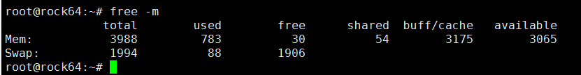

#Drop mem caches tool

Look at the picture above.It out of free memory because 3715M memory was buff/caches.
It cause the system to slow down,then i need to drop mem caches.
## 1.Create logs directory
##2.set low_mem value
```python
low_mem=500
```
  The default Settings is 500M。It means if current free mem lower than this value,it will
  drop mem caches.
 
##2.config crontab file
```jshelllanguage
*/5  *	* * *	root	cd /usr/local/bin/drop_caches_tool ; python3 drop_caches_tool.py
```
It will execute script every 5 minutes.
Modify your file directory,then excute shell
```jshelllanguage
 service cron reload
 service cron restart
```
